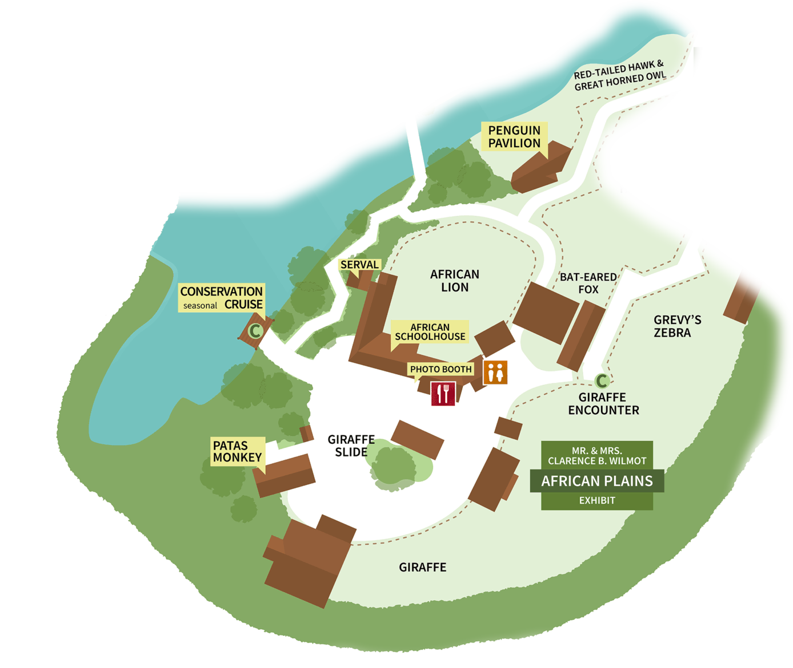

Servals

   
Zoo Boise has two servals:
   
- Scout
   
- Mzuri
   
   

African Lions

   
Zoo Boise has two lions:
   
- Revan is the male, and of course has a mane. He frequently chuffs in the morning. He is named after the character Darth Revan from Star Wars books.
   
- Ahsoka is the female, so she does not have a mane. She loved playing with her ball and trying to get Revan to play with her. She is named after the character Ahsoka Tano, from Star Wars TV shows.
   
   
  Revan's roaring and chuffing:
   
  <audio controls>
  <source src="sounds/revan.ogg" type="audio/ogg">
  <source src="sounds/revan.mp3" type="audio/mpeg">
Your browser does not support the audio element.
</audio>

Reticulated Giraffes

   
Zoo Boise has two giraffes:
   
- Jabari is the older male. He has much darker patches.
   
- Tafari is the younger male. His patches are lighter.
   
   

Bat-Eared Foxes

   
Zoo Boise has two bat-eared foxes:
   
- Fletcher
   
   

Lowland Nyala

   
Zoo Boise has two nyala:
   
- Henry is the younger male. He recently reached adulthood, which means he is now gray with horns, like all male nyala.
   
- Zara is the older female. She is brown with white stripes, as are all female or young nyala.
   
   
  The nyala share an exhibit with the southern ground hornbills
   
   

Southern Ground Hornbills

   
Zoo Boise has two southern ground hornbills in the African Plains exhibits:
   
- Hank is the male. As a male, his throat patch is larger and almost entirely orange.
   
- Google is the female. As a female, her throat patch is smaller and has a mix of orange and blue.
   
   
  The southern ground hornbills share an exhibit with the nyala.
   
   

Grevy's Zebra

   
Zoo Boise has two zebra:
   
- Zeke is the male. He has a notch in one of his ears
   
- Hope is the female. She does not have a notch in her ears
   
   

Magellanic Penguins

   
Zoo Boise has 10 penguins. They are identified by colors bands on their wings. Bands on the left wing mean the bird is a male, and bands on the right wing mean the bird is a female. "Females are always right."
   
- Jimmy has Orange and Blue bands on his Left wing (BSU Colors)
   
- Rose has two White bands on her Right wing
   
- Bocelli has two Yellow bands on his Left wing
   
- Puddin has Purple and Green bands on his Left wing
   
- Kusi has a Pink band on her Right wing
   
- Lois has Pink and Yellow bands on her Right Wing
   
- Milo has Blue and White bands on his Left wing
   
- Daisy has Yellow and Green bands on her Right wing
   
   

