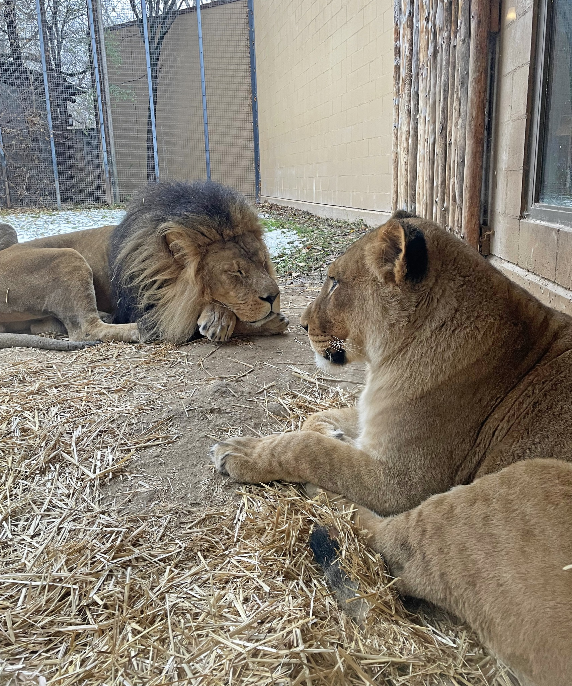

Serval

   
Zoo Boise has one serval:
   
- Scout
   
   

African Lion

   
Zoo Boise has two lions:
   
- Revan is the male, and of course has a mane. He frequently chuffs in the morning. He is named after the character Darth Revan from Star Wars books.
   
- Ahsoka is the female, so she does not have a mane. She loved playing with her ball and trying to get Revan to play with her. She is named after the character Ahsoka Tano, from Star Wars TV shows.
   
   
  Revan's roaring and chuffing:
   
  <audio controls>
  <source src="sounds/revan.ogg" type="audio/ogg">
  <source src="sounds/revan.mp3" type="audio/mpeg">
Your browser does not support the audio element.
</audio>

Patas Monkey

   
Zoo Boise has three patas monkeys:
   
- Incus is the only male. He is the biggest.
   
- DJ is the older female. She sometimes holds a hand over her eye.
   
- Moka is the younger female and the child of Incus and DJ. She is rounder than the other two.
   
   

Reticulated Giraff

   
Zoo Boise has two giraffes:
   
- Jabari is the older male. He has dark, solid patches.
   
- Tafari is the younger male. His patches are lighter and non-solid.
   
   

Bat-Eared Foxes

   
Zoo Boise has one bat-eared fox:
   
- Fletcher
   
   

Lowland Nyala

   
Zoo Boise has two nyala:
   
- Henry is the younger male. Since he reached adulthood, he is now with horns, like all male nyala.
   
- Zara is the older female. She is brown with white stripes, as are all female or young nyala.
   
   
  The nyala share an exhibit with the southern ground hornbills
   
   

Southern Ground Hornbills

   
Zoo Boise has two southern ground hornbills in the African Plains exhibits:
   
- Hank is the male. As a male, his throat patch is larger and almost entirely orange.
   
- Google is the female. As a female, her throat patch is smaller and has a mix of orange and blue.
   
   
  The southern ground hornbills share an exhibit with the nyala.
   
   

Magellanic Penguins

   
Zoo Boise has 8 penguins. They are identified by colors bands on their wings. Bands on the left wing mean the bird is a male, and bands on the right wing mean the bird is a female, with the exception of the new male. "Females are always right."
   
- Jimmy has Orange and Blue bands on his Left wing (BSU Colors)
   
- Rose has two White bands on her Right wing
   
- Bocelli has two Yellow bands on his Left wing
   
- Puddin has Purple and Green bands on his Left wing
   
- Kusi has a Pink band on her Right wing
   
- Lois has Pink and Yellow bands on her Right Wing
   
- A new unnamed male has a black band with Purple beads on his Right Wing. These are his markings from a previous zoo and are yet to be changed.
   
- Daisy has Yellow and Green bands on her Right wing
   
   

Inca Tern

   
Zoo Boise has three inca terns:
   
- Pacha has a blue band on his left leg and a silver band on his right leg. He is named after the character from the animated Disney movie, Emperor's New Groove, which takes place in their natural habitat
   
- Yzma has a green band on her right leg. She is named after the character from the animated Disney movie, Emperor's New Groove, which takes place in their natural habitat
   
- Chico has a blue band on both legs.
   
   

Grevy's Zebra

   
Zoo Boise has two zebra:
   
- Zeke is the male. He has a notch in one of his ears
   
- Hope is the female. She has a very short stripe on her left flank.
   
   

Red-Tailed Hawk

   
Zoo Boise has one red-tailed hawk:
   
- Gamora is a female. 
   
  As with all red-tailed hawks, she is only allowed to be kept under human care to an injury that prevents her from flying. Guests often ask if she has enough room, but because of her inability to fly, she does.
   
   

Great Horned Owl

   
Zoo Boise has one great horned owl:
   
- Bob is a male. 
   
  As with all great horned owls, he is only allowed to be kept under human care to an injury that prevents her from flying. His right wing visibly droops down because of this.
   
   

Kinkajou

   
Zoo Boise has one kinkajou:
   
- Chewie (short for Chewbacca) is a male. 
   
  Chewie is Zoo Boise's resident amputee. He had a partial amputation of his right arm in 2020. His exhibit has been modified to allow him mobility.
   
  As a nocturnal animal, he is rarely seen by guests except during training, feeding, and evening events.
   
   

Grevy's Zebra

   
Zoo Boise has two zebra:
   
- Zeke is the male. He has a notch in one of his ears
   
- Hope is the female. She has a very short stripe on her left flank.
   
   

African Schoolhouse Terrariums:

Kenyan Sand Boa

   
Zoo Boise has one sand boa:
   
- Unnamed male
   
   

Ornate Horned Frog (aka Pacman Frog)

   
Zoo Boise has one Ornate Horned Frog:
   
- Clyde
   
   

Amazon Milk Frog

   
Zoo Boise has 5, unnamed Amazon milk frogs, in addition to tadpoles:
   
   

Lesser Hedgehog Tenrec

   
Zoo Boise has one tenrec:
   
- Charlotte prefers to lay upside down with her feet in the air, which makes her look dead
   
   
  Despite her name, tenrecs have zero relation to hedgehogs. Their similar anatomy is a great example of convergent evolution.
   
   

