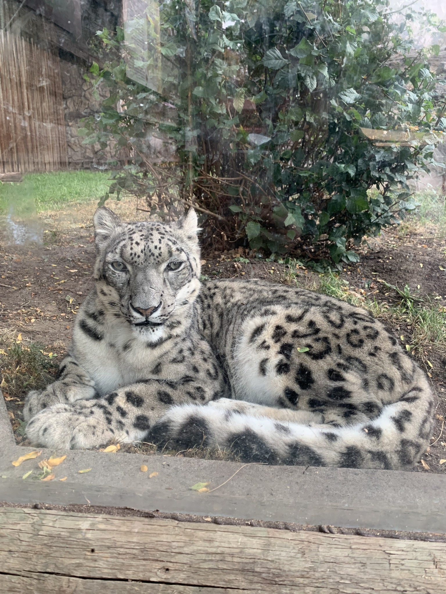
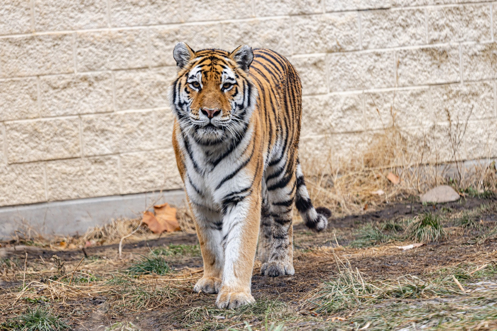

Snow Leopard

   
Zoo Boise has one snow leopard:
   
- Sabu
   
   

Amur Tiger

   
Zoo Boise has one tiger:
   
- Akasha is an older female tiger. She moved to the zoo when she was no longer able to participate in an SSP (Species Surival Plan). She lives here because our zoo can't support cubs, and that opens up a space for cub-bearing females at other institutions.
   
   
  Akasha's chuffing:
   
  <audio controls>
  <source src="sounds/akasha.ogg" type="audio/ogg">
  <source src="sounds/akasha.mp3" type="audio/mpeg">
Your browser does not support the audio element.
</audio>

Styan's Red Pandas

   
Zoo Boise has two Styan's red pandas:
   
- Jasper is the male, and is missing some front teeth, leading to his tongue sticking out most of the time.
   
- Stevie is the female, and is a bit defensive of her indoor area, often not allowing Jasper to come in. She is most frequently near the back of her exhibit or inside.
   
   

