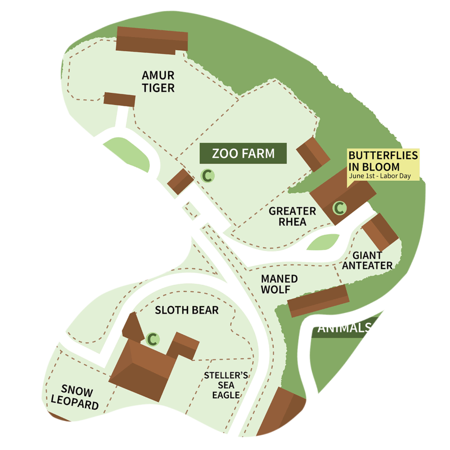
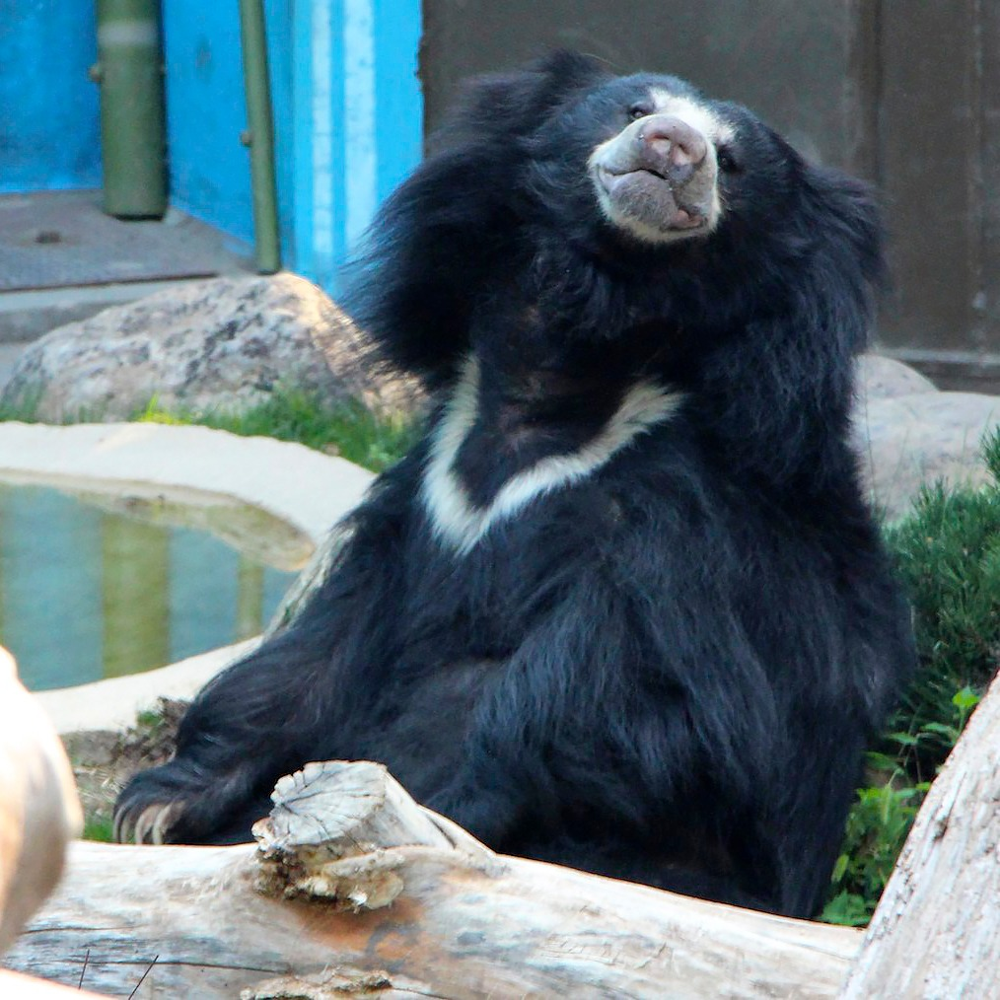
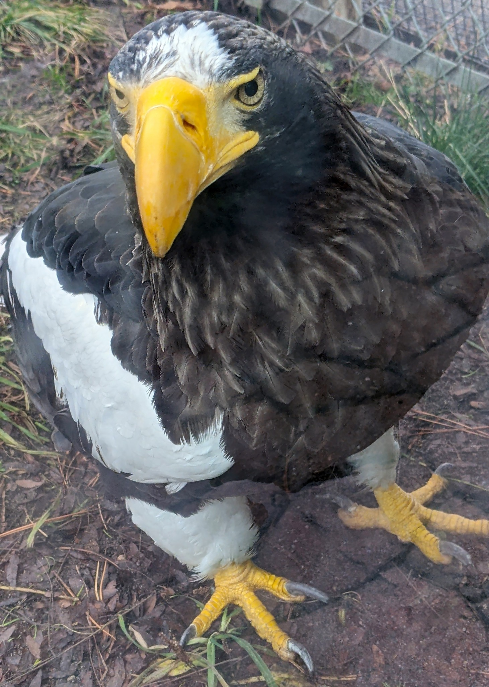

Snow Leopard

   
Zoo Boise has one snow leopard:
   
- Sabu
   
   

Sloth Bear

   
Zoo Boise has one sloth bear:
   
- Paji is a female sloth bear. She is often moody, and only does things if she wants to. The Sloth Bear Encounter is an opportunity to feed her mealworms through a tube, but she frequently chooses not to participate, or takes a lot of coaxing to do so.
   
   

Steller's Sea Eagle

   
Zoo Boise has one sea eagle:
   
- Vlad is a male sea eagle. He can occasionally be heard screeching, which is audible throughout the surrounding areas.
   
   

Amur Tiger

   
Zoo Boise has one tiger:
   
- Akasha is an older female tiger. She moved to the zoo because her genetics were well represent in AZA zoos, which didn't allow her to participate in an SSP (Species Surival Plan). She lives here because our zoo can't support cubs, and that opens up a space for cub-bearing females at other institutions.
   
   
  Akasha's chuffing:
   
  <audio controls>
  <source src="sounds/akasha.ogg" type="audio/ogg">
  <source src="sounds/akasha.mp3" type="audio/mpeg">
Your browser does not support the audio element.
</audio>

Zoo Farm

   
Zoo Boise has many goats:
   
- Kermit is a mixed breed goat, with a large portion of the Boer breed. He is mostly white, except for light brown sides of his face.
   
- Mouse is a mixed breed goat, with a large portion of the Boer breed. He is mostly white except for his dark brown sides of his face and a large brown spot on his chest.
   
- Maverick is a mixed breed goat, with a large portion of the Boer breed. He is mostly white, except for his light brown sides of his face and two large brown spots 
 on the back of his neck.
   
- Goose is a mixed breed goat, with a large portion of the Boer breed. He is mostly white, except for two small brown spots on the left of his neck and some pale tan coloring on his face.
   
- Ross is an Oberhasli-Brienz goat. He is mostly dark brown, except for his white legs.
   

