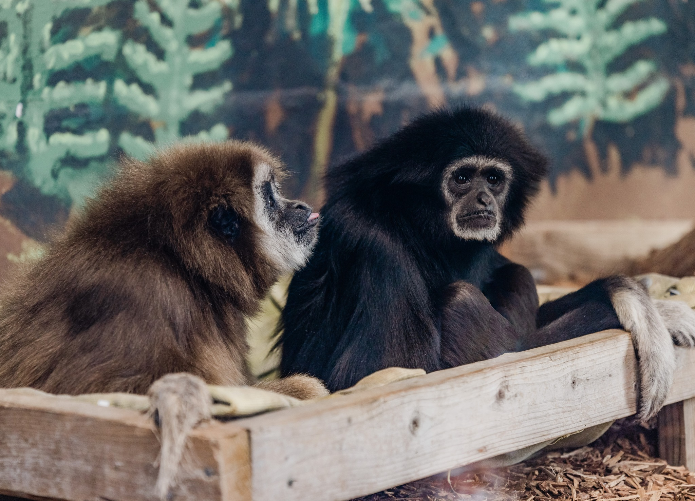
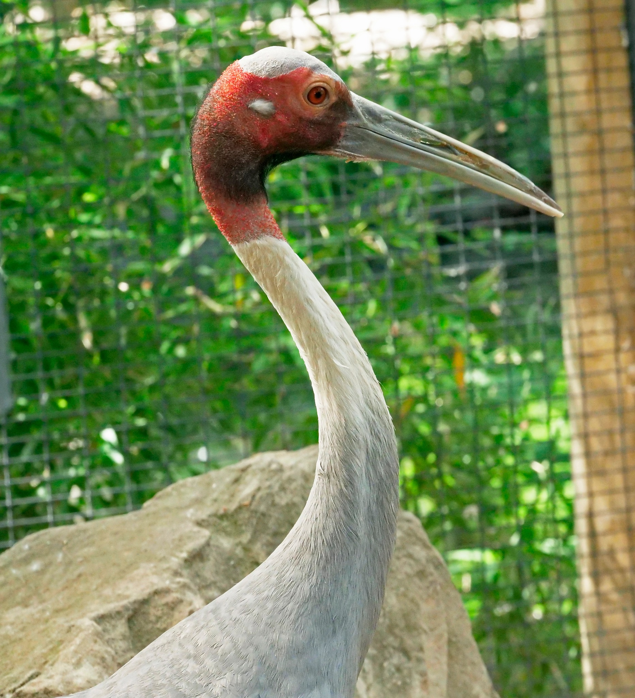
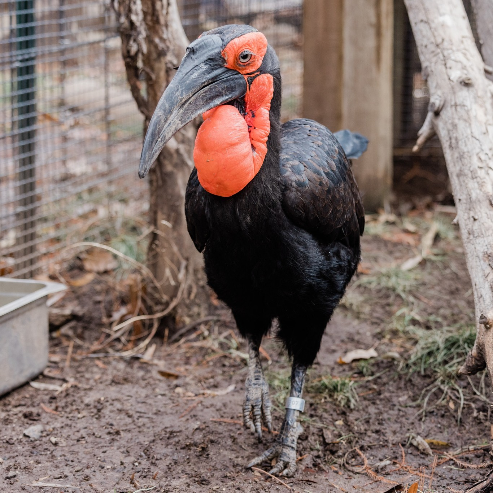
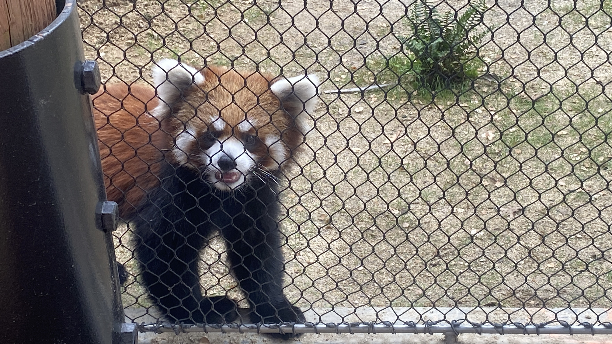
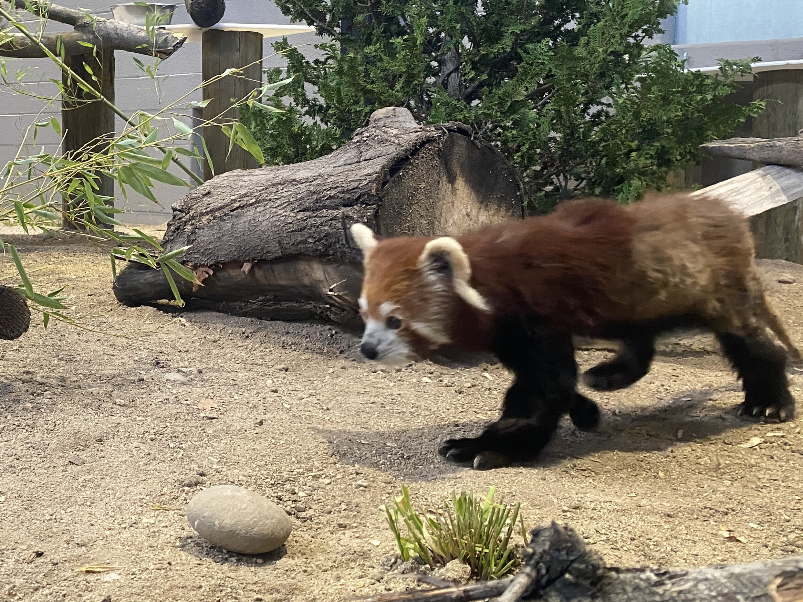

White-Handed Gibbons

   
Zoo Boise has two gibbons:
   
- Euhl, better known as Papa, is brown in color. He rarely swings, and makes a soft, low whooping sound occasionally.
   
- Li Bao, who is Papa's daughter, is black in color. She is almost always in the trees, and sings a high-pitched song that can be heard throughout the zoo.
   
   
  Li Bao's song:
   
  <audio controls>
  <source src="sounds/li_bao.ogg" type="audio/ogg">
  <source src="sounds/li_bao.mp3" type="audio/mpeg">
Your browser does not support the audio element.
</audio>
   
   

Sarus Crane

   
Zoo Boise has one sarus crane:
   
- Claudia gets very excited when her keepers are nearby, and she frequently dances for them. She also makes a trumpeting sound that could be mistaken for elephants.
   
   

Southern Ground Hornbill

   
Zoo Boise has one southern ground hornbill in the plaza:
   
- Toogle is a favorite of guests, volunteers, and staff! He was hand-raised due to special circumstances, so he loves showing off his treasures and food (typically a mouse or chick) to shocked guests. He makes a distinctive booming sound, which can be heard in the surrounding areas.
   
   

Chinese Red Pandas

   
Zoo Boise has three Chinese red pandas, a pair and an individual:
   
- Jasper is the male in the pair, and is missing some front teeth, leading to his tongue sticking out most of the time. He is more red in coloring than Stevie and likes to nest in one of the doors to the bridge.
   
- Stevie is the female in the pair. She is much more active than Jasper, but also likes to nest in one of the doors to the bridge.
   

   
- The zoo also has one unamed female Chinese Red Panda. She will most likely receive a name at Zoobilee. She is the youngest of both the Chinese and Himalayan Red Pandas. Additionally, she will be matched with mate at a future date.
   
   

Himalayan Red Panda

   
Zoo Boise has one Himalayan red panda:
   
- The zoo also has one unamed male Himalayan Red Panda. He overgrooms himself, which has caused his lower half to have less dense hair. This does not cause him harm, and all tests by veterinarians show he is happy and healthy. Guests WILL ask about this, though. He will most likely receive a name at Zoobilee.
   
   

