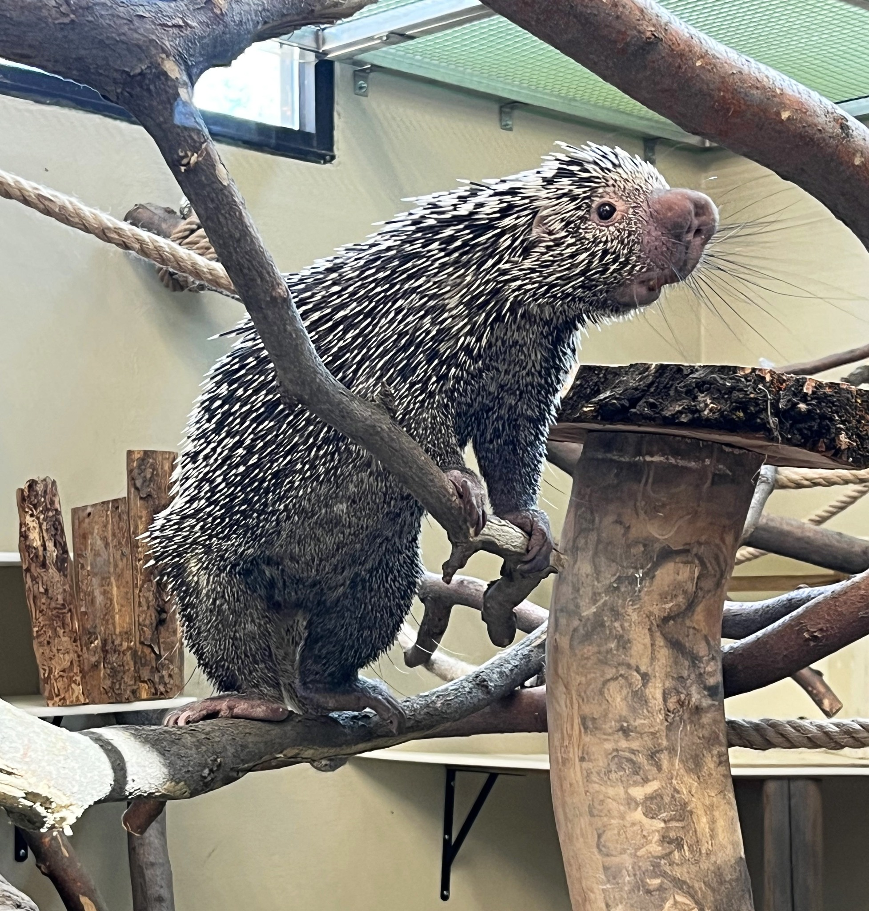

Aldabra Tortoise

   
Zoo Boise has two Aldabra tortoises:
   
- Mr. Mac is the much larger and older male. He is the only one visible when inside and is always on the south side of the yard. He was born around 1920, and is one of the only animals at the zoo that was born in their natural habitat.
   
- Miss Mac is the smaller and younger female. She is not visible when she is inside and is always on the north side of the yard. She was born around 1951. It is unclear if she was born in her natural habitat.
   
   
  Mr. and Miss Mac are separated due to Miss Mac's scoliosis. If Mr. Mac attempted to mate with Miss Mac, it is very possible the pressure would break her spine. Their previous exhibits had them completely isolated from one another, but the newer one allows them to physically interact while having a separate space.
   
   

Sand Cats

   
Zoo Boise has two sand cats:
   
- Nala is the smaller female. She is much thinner and leaner than Simba. She has been described as "viscious" by those who interact with her.
   
- Simba is the bigger male. He is somewhat stocky, which is much more obvious when they are near each other.
   
   

Spider Monkeys

   
Zoo Boise has two spider monkeys:
   
- Elvis is a male Variegated Spider Monkey. He has intense, bright blue eyes. Despite both monkeys being referred to as Black-Handed Spider Monkeys on signage, Elvis is a similar but distinct species. The reason the signage does not reflect this is that, due to Elvis' age of around 60 (20 years over the average life expectancy), an additional sign is a potential waste of funding. His bright blue eyes are a species trait that is incredibly rare in other spider monkey species.
   
- Sarah is a female Black-Handed Spider Monkey. She has softer brown eyes. Female spider monkeys have an external psuedo-penis that causes many guests to indentify Sarah as a male.
   
   
  Both spider monkeys were previously kept under private ownership, and their resulting behavior may trigger questions from some guests. 
   
  Sarah was likely dressed up like a doll, which has caused her to frequently hold her arms around herself. 
   
  Elvis has a particular dislike of adult men with dark beards, which indicates that he was likely abused by one. If he sees someone who fits this description, he may hide, leave, or scream. If you see the latter behavior, explain to a guest that turning their back to him and avoiding eye contact will make him more comfortable. 
   A great talking point with guests is that to keep Elvis comfortable, he only has female keepers. Keepers also always leave both of them a clear path out of training sessions so that they never feel forced to do anything. It's also good to talk about why some animals don't make good pets.
   
   

Grand Cayman Blue Iguana

   
Zoo Boise will, at some point in the next few months, receive a male blue iguana. Once he is comfortable, a female may be brought for a breeding pair. Blue iguanas are critically endangered, but have some of the easiest and most successful reintroductions. Unlike most animals, an iguana born in zoos can be reintroduced under specific circumstances, without needing a multi-generational introduction like many species.
   

Two-Toed Sloth

   
Zoo Boise will, at some point in the next few months, receive a male two-toed sloth. He will live with the Prehensile-Tailed Porcupine
   

Prehensile-Tailed Porcupine

   
Zoo Boise has one prehensile-tailed porcupine:
   
- Ozzy is a male porcupine. 
   
  As a nocturnal animal, he is often asleep for much of the day. He will be much more active in the morning, late afternoon/evening, and during feeding/training
   
   

